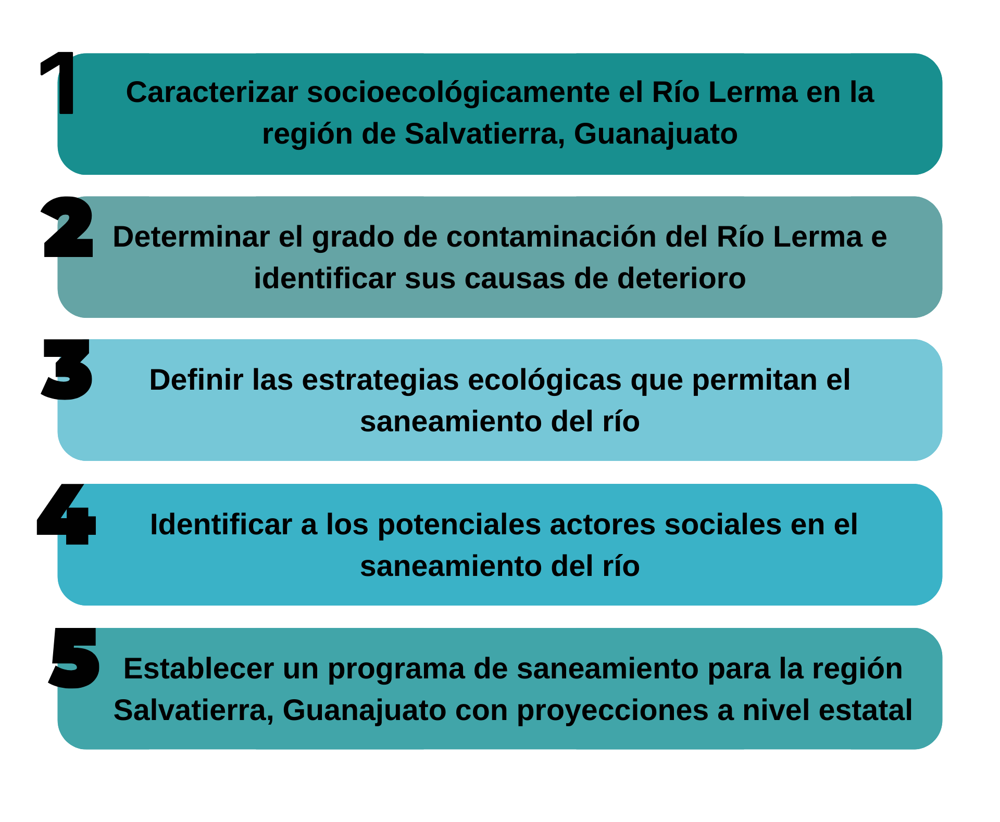
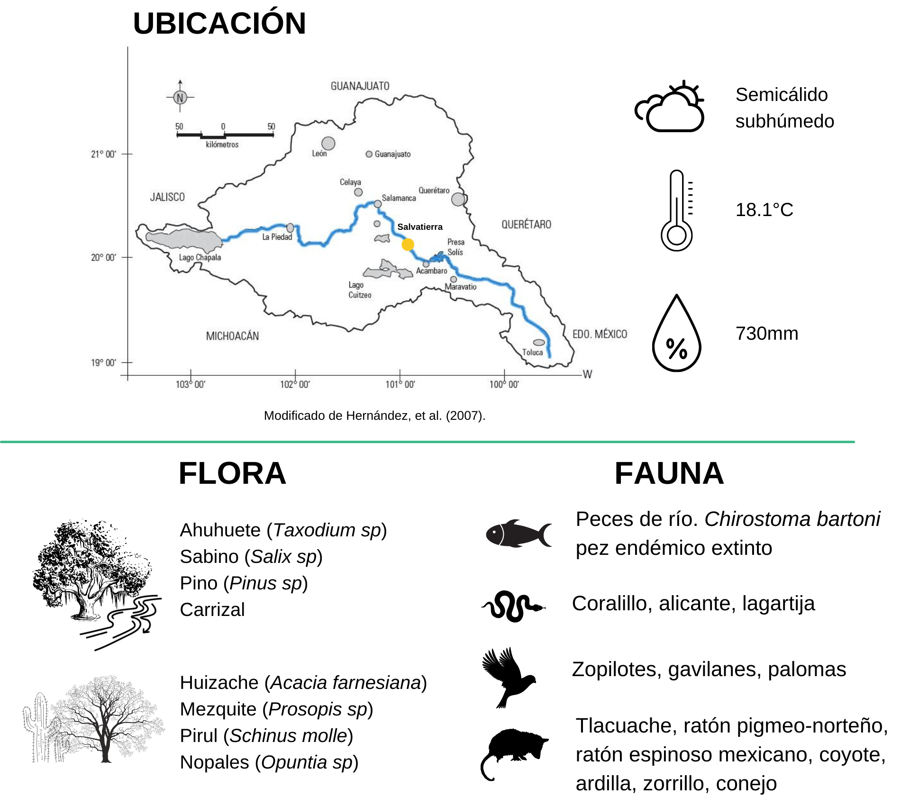
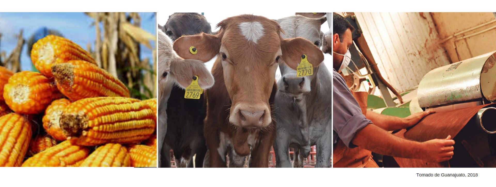

## Restauración del Río Lerma

--- 

### Introducción

---

El proyecto se enfoca en restaurar el Río Lerma el cual es uno de los ríos más grandes del México, que pasa por los estados de Jalisco, Querétaro, Guanajuato, Michoacán y el Estado de México. La importancia del río no solo es por su extención, sino porque aparte es uno de los ríos de mayor uso intensivo, que sostiene a varias industrias como campos agrícolas y ganaderos, de alimentos, farmacéuticas, de papel, entre otras. Por ello, restaurar el río Lerma es muy importante para poder evitar que estas industrias pierdan recursos y que las poblaciones cercanas sufran consecuencias a su salud, debido al mal estado del río.

El **ODS** involucrado en nuestro club es el No. 15 "Vida de Ecosistemas Terrestres", el cual consiste en restaurar y cuidar ecosistemas dañados para evitar enfermedades generadas por estos ecosistemas, además de preservar la fauna y flora que contengan estos ecosistemas. Nuestro proyecto involucra la cooperación no solo de la sociedad y gobierno, sino también del sector privado para que se evite la descarga de residuos dañinos para el río, además de generar una regulación para el manejor de residuos de las industrias y generar empleos que sea sostenibles gracias al río. Durante el club logramos aprender estrategias para poder monitorear especies, ver la restauración de un ecosistema muy dañado y ver estrategias para obtener fondos y apoyo para que el proyecto se pueda realizar.

### Objetivos particulares

---

### Resultados

---

#### 1 Caracterización socioecológica del Río Lerma en la región de Salvatierra, Guanajuato

Salvatierra es un municipio del estado de Guanajuato que se coincide hidrológicamente con las cuencas río Lerma-Salamanca y laguna de Pátzcuaro-Cuitzeo-Yuridia. En esta región dominan los climas: semicálido (semicálido subhúmedo) y templado (templado subhúmedo). La temperatura oscila entre 2 y 33.4 °C, con una media anual de 18.1°C. La precipitación pluvial ronda los 730mm anuales (CONABIO y IEE, 2015).
La flora asociada al Río Lerma es: ahuehuete, sauce, carrizal y pino. Sin embargo, la diversidad de flora es diversa también en zonas aledañas, donde se puede observar huisache, mezquite, pirul, nopales, joconostle, garambullo y navajillo (H. Ayuntamiento de Salvatierra, 2018).
La fauna es representada por cientos de grupos de vertebrados e invertebrados. Dentro de los animales más representados encontramos: conejo, tlacuache, coyote, ardilla, coralillo, alicante, zorrillo, lagartija, peces de río, zopilotes, gavilanes y palomas (H. Ayuntamiento de Salvatierra, 2018).

La región de Salvatierra sostiene a 97,054 habitantes. Las principales actividades económicas de la región son la agricultura, la ganadería y la industria textil. La agricultura constituye la principal actividad productiva, ya que genera el 26.17% del Producto Interno Bruto (PIB) de la región, abarca el 70% de extensión en el municipio y se produce 32 variedades de diferentes cultivos entre los que se incluye: guayaba, ajo, maíz, etc.

#### 2 Grado de contaminación del Río Lerma y causas de deterioro

Un estudio de 2007 (Sedeño-Días y López-López) señala que el promedio de calidad de agua de este caudal (WQI por sus siglas en inglés Water Quality Index) es entre 32.3 y 43.6, una muy baja calidad considerando que el valor más alto es 100, y que por debajo de los 50 puntos no es apta para consumo humano. 

La degradación de este río está densamente documentada. De acuerdo con esta información, podemos distinguir los factores de deterioro según su fuente: doméstica, agropecuarios e industriales.

O utilizando codigo html ``, la ventaja de utilizar html es que le puedes modificar el tamaño utilizando **width**.

### Conclusiones

---

Comparte tus observaciones, lo aprendedido, limitaciones y siguientes pasos. 

### Video

---

 1. Para insertar un video de YouTube, en la página de YouTube del video selecciona compartir y selecciona el código de html.
 <iframe width="560" height="315" src="https://www.youtube.com/embed/PLj1-CMNERM" title="YouTube video player" frameborder="0" allow="accelerometer; autoplay; clipboard-write; encrypted-media; gyroscope; picture-in-picture" allowfullscreen></iframe>
 
 2. Insertar el link de tu video en YouTube, [nuestro video](https://youtu.be/rmXvlBPq24Q).
 4. Puedes subir el archivo de tu video directamente a Github [instrucciones aquí](https://stackoverflow.com/questions/4279611/how-to-embed-a-video-into-github-readme-md)
 
### Equipo

---

* Rojas Martínez Jonathan Francisco
* García Noemí

For more details see [GitHub Flavored Markdown](https://guides.github.com/features/mastering-markdown/).

### Bibliografía

* López-Hernández, M. (2007, julio). Análisis multimétrico para evaluar contaminación en el río Lerma y lago de Chapala, México. SCIELO. [http://www.scielo.org.mx/scielo.php?script=sci_arttext&pid=S0188-88972007000400003](http://www.scielo.org.mx/scielo.php?script=sci_arttext&pid=S0188-88972007000400003)
* Redacción AM. (2016, 26 abril). Contaminan El Sabinal en Salvatierra. am. [https://www.am.com.mx/noticias/Contaminan-El-Sabinal-en-Salvatierra-20160425-0066.html]
* Guanajuato - Salvatierra. (s. f.). INAFED. Recuperado 19 de agosto de 2021, de [http://www.inafed.gob.mx/work/enciclopedia/EMM11guanajuato/municipios/11028a.html](http://www.inafed.gob.mx/work/enciclopedia/EMM11guanajuato/municipios/11028a.html)
* Gobierno de Salvatierra. (2020). Programa Municipal de Desarrollo Urbano y de Ordenamiento.[https://seieg.iplaneg.net/seieg/doc/SALVATIERRA_VI_1590188318.pdf](https://seieg.iplaneg.net/seieg/doc/SALVATIERRA_VI_1590188318.pdf)
* Secretaría de Medio Ambiente y Recursos Naturales. (2020). PROYECTO HIDROELECTRICO PARA LA GENERACION DE ENERGIA RENOVABLE DE LA HIDROELECTRICA LA CAROLINA, SALVATIERRA, GUANAJUATO, MEX. [https://apps1.semarnat.gob.mx:8443/dgiraDocs/documentos/gto/estudios/2019/11GU2019E0111.pdf](https://apps1.semarnat.gob.mx:8443/dgiraDocs/documentos/gto/estudios/2019/11GU2019E0111.pdf)

