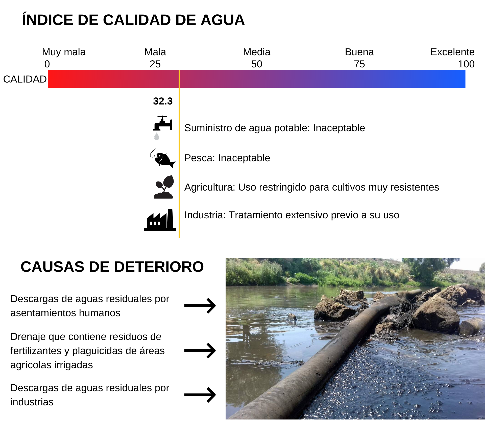

## Plan de saneamiento del Río Lerma en camino hacia su restauración ecológica

--- 

### Introducción

El proyecto se enfoca en el saneamiento del Río Lerma como primer paso hacia su restauración ecológica. El Río Lerma es uno de los ríos más grandes de México, con 750 km de largo pasa por los estados de Jalisco, Querétaro, Guanajuato, Michoacán y el Estado de México. Este río constituye uno de los cuerpos de agua más importantes de nuestro país no sólo por sostener numerosos pueblos y ciudades del centro de México, sino porque es uno de los ríos de mayor uso intensivo por industrias de campos agrícolas y ganaderos, de alimentos, farmacéuticas, de papel, de curtiduría, entre otras. Sin embargo, esto mismo hace que el Río Lerma esté sometido a constantes presiones antrópicas que hacen de este importante río uno de los más degradados de México (Sedeño-Díaz y López-López 2007). Restaurar el Río Lerma debe ser una prioridad a nivel local, estatal y federal por todos los servicios ecosistémicos que ofrece y por la diversidad biológica que tiene, aspectos que se ven realmente comprometidos y en peligro por sus altos niveles de contaminación. Asimismo, recuperar la estructura y funcionalidad de este cuerpo de agua es muy importante para evitar pérdidas económicas en las industrias que sostiene y para evitar que las poblaciones cercanas sufran consecuencias a su salud debido al mal estado del río.

El **ODS** involucrado en nuestro club *Sustainable Ecosystem Restoration* es el No. 15 "Vida de Ecosistemas Terrestres". Este objetivo consiste en restaurar y cuidar ecosistemas dañados para evitar enfermedades generadas por estos ecosistemas, además de preservar la fauna y flora que los habitan. Nuestro proyecto busca dar el primer paso hacia la restauración ecológica del Río Lerma, ya que, por las características de este cuerpo de agua, su restauración ecológica trasciende a diferentes niveles sociales y ecoógicos.  Nuestro principal objetivo es generar las condiciones necesarias para implementar estrategias de restauración más factibles en el futuro. En este sentido, buscamos involucrar a las comunidades, industrias y gobiernos locales en la concientización sobre la importancia del río y su estado de deterioro, evitar la descarga de residuos dañinos, contribuir a su limpieza y saneamiento, y generar empleos que sean sostenibles gracias al buen estado del río. Durante el club *Sustainable Ecosystem Restoration* logramos aprender estrategias que nos permitieran alcanzar estos objetivos a través de temas  como: restauración de ecosistemas acuáticos, estrategias de bioremediación, monitoreo de especies, estrategias para obtener fondos y apoyo para la implementación de proyectos. A continuación presentamos nuestros objetivos particulares para el caso de Saneamiento del Río Lerma en la región de Salvatierra Guanajuato, los resultados obtenidos y nuestro aprendizaje colectivo.

### Objetivos particulares

---

### Resultados

---

#### 1 Caracterización socioecológica del Río Lerma en la región de Salvatierra, Guanajuato

Salvatierra es un municipio del estado de Guanajuato que se coincide hidrológicamente con las cuencas río Lerma-Salamanca y laguna de Pátzcuaro-Cuitzeo-Yuridia. En esta región dominan los climas: semicálido (semicálido subhúmedo) y templado (templado subhúmedo). La temperatura oscila entre 2 y 33.4 °C, con una media anual de 18.1°C. La precipitación pluvial ronda los 730mm anuales (CONABIO y IEE, 2015).

La flora asociada al Río Lerma es: ahuehuete, sauce, carrizal y pino. Sin embargo, la diversidad de flora es diversa también en zonas aledañas, donde se puede observar huisache, mezquite, pirul, nopales, joconostle, garambullo y navajillo (H. Ayuntamiento de Salvatierra, 2018).
La fauna es representada por cientos de grupos de vertebrados e invertebrados. Dentro de los animales más representados encontramos: conejo, tlacuache, coyote, ardilla, coralillo, alicante, zorrillo, lagartija, peces de río, zopilotes, gavilanes y palomas (H. Ayuntamiento de Salvatierra, 2018).

La región de Salvatierra sostiene a 97,054 habitantes. Las principales actividades económicas de la región son la agricultura, la ganadería y la industria textil. La agricultura constituye la principal actividad productiva al abarcar el 70% de extensión en el municipio y producir 32 variedades de diferentes cultivos entre los que se incluye: guayaba, ajo, maíz y otros (H. Ayuntamiento de Salvatierra, 2018). Salvatierra también es una comunidad característica por sus actividades comerciales de curtiduría (Guanajuato, 2012). 

---

#### 2 Grado de contaminación del Río Lerma y causas de deterioro

Un estudio de 2007 (Sedeño-Días y López-López) señala que el promedio de calidad de agua de este caudal (WQI por sus siglas en inglés Water Quality Index) es entre 32.3 y 43.6, una muy baja calidad considerando que el valor más alto es 100, y que por debajo de los 50 puntos no es apta para consumo humano. 

La degradación de este río está densamente documentada. De acuerdo con esta información, podemos distinguir los factores de deterioro según su fuente: doméstica, agropecuarios e industriales. Las fuentes domésticas son desechos que provienen de lugares públicos y privados. Debido al rápido crecimiento de Salvatierra, muchas zonas no poseen un drenaje planificado ni una planta de tratamiento de residuos,  por lo que dichas aguas se vierten directamente en los cuerpos de agua por los alcantarillados pluviales. Estas mismas escorrentías arrastran residuos de plaguicidas y pesticidas empleados en el suelo para la mejora de cultivos. Sin embargo, la base de estos productos son altamente contaminantes para los cuerpos de agua. Por su parte, la industria del curtido de pieles es una de las más contaminantes por el tipo de desechos que genera a lo largo de su proceso productivo. Muchos de estos residuos terminan en el río Lerma contribuyendo a su contaminación. La principal característica del agua que fluye por este río es un color grisáceo y un mal olor, debido en gran parte a los efluentes líquidos de la industria del curtido que tienen altas concentraciones de materia orgánica, compuestos de nitrógeno, sulfuros, pHs elevados, sólidos suspendidos y compuestos de cromo (Guanajuato, 2012).

---

#### 3 Estrategias ecológicas para saneamiento del río Lerma en el tramo Salvatierra, Guanajuato

A continuación proponemos tres principales estrategias de saneamiento.

---

#### 4 Actores potenciales participantes en el saneamiento del río Lerma

* Red Munners.

Con Red Munners se pueden lograr voluntariados para la limpieza y monitoreo de la flora y fauna que se encuentre en la zona. Proponemos la participación de jóvenes que, como nosotros, se interesen en la mejora de su entorno, por lo que buscamos la vinculación entre Red Munners e instituciones educativas cercanas a la localidad para la generación servicios sociales y profesionales.

* Gobierno del municipio de Salvatierra.

El gobierno de Salvatierra tiene un plan de desarrollo urbano en el cual detalla que para el cuidado y recuperación del río. Proponemos que en conjunto con el gobierno local se delimiten las zonas federales del río, se establezcan los alcances del plan de saneamiento y se provea del apoyo económico para las diferentes etapas. Esto ayudará a poder identificar las zonas de mayor impacto y llevar a cabo el plan de saneamiento, y restauración, de forma ordenada.

* Empresas que quieran ser reconocidas como ambientalmente responsables.

El río Lerma se encuentra en constante uso por parte de empresas, ya sea por la descarga de residuos como del uso del agua para agricultura, ganado, etc. Por ello dar un reconocimiento a las empresas que eviten y regulen de manera correcta sus residuos, o moderen su consumo de agua, se les hará acredoras de un certificado que avale que son ambientamente responsables. Este reconocimiento es muy importante para la sociedad actualmente y da un valor agregado al producto que elaboren.

* Colaboración con colectivo H2O Lerma.

H20 Lerma es un colectivo que busca el saneamiento de los pozos mediante filtros químicos que están hechos con cascarones de huevo, óxido de magnesio y cal. Estas barreras logran filtrar contaminantes como mentales pesados y materia orgánica. Proponemos colaborar de forma activa con H2O Lerma básandonos en sus experiencias y colecta de cascarones de huevo para implementar esta estrategia de saneamiento en pozos en Salvatierra Guanajuato.

---

#### 5 Programa de saneamiento del río Lerma en el tramo Salvatierra, Guanajuato

---

### Conclusiones

---
Durante esta versión de Clubes de Ciencia reconocimos que la principal problemática del Río Lerma es su estado de contaminación y deterioro. Al ser uno de los ríos más extensos de México, el Río Lerma no solo constituye uno de los ríos de mayor importancia ecológica, social y económica, sino que también es uno de los ríos más usados y uno de los más contaminados de nuestro país. La restauración ecológica del río Lerma debe ser una prioridad para los diferentes niveles gubernamentales, las industrias y la sociedad en general, por lo que todos debemos participar en su recuperación. 

La Restauración Ecológica del Río Lerma es una práctica que busca la recuperación de la estructura, funcionalidad y autosuficiencia semejantes a las presentadas previamente en el río ahora degradado. Sin embargo, por su extensión, y los diferentes niveles políticos y sociales que atraviesa, esta tarea es sumamente compleja de coordinar, ya que involucra a cinco estados de la Republica Mexicana, numerosas industrias y cientos de pueblos, comunidades y ciudades. Pese a este difícil escenario, consideramos que aún no es demasiado tarde para tomar las acciones necesarias para la restauración del Río Lerma. Hoy, como parte de Clubes de Ciencia, proponemos empezar por el saneamiento del río en Salvatierra, Guanajuato, una región centro representativa de otras comunidades aledañas al río. Con el plan de saneamiento buscamos generar las condiciones necesarias para seguir trabajando en proyectos que permitan la recuperación del Río y una restauración futura. Proyectamos que este trabajo continuará expandiendose a otros municipios de Guanajuato, y posteriormete a otros estados como Jalisco, Querétaro, Estado de México y Michoacán.

Reconocemos que la participación colectiva es primordial por lo que invitamos a los lectores a conocer más sobre este importante río, saber cómo beneficia a tu comunidad, exigir a nivel local que se tomen las acciones necesarias para empezar su saneamiento y acercarse a los diferentes colectivos que mencionamos para dar continuidad a todo el proceso de restauración. ¡Tú también puedes colaborar!

### Video

---

 1. Para insertar un video de YouTube, en la página de YouTube del video selecciona compartir y selecciona el código de html.
 <iframe width="560" height="315" src="https://www.youtube.com/embed/PLj1-CMNERM" title="YouTube video player" frameborder="0" allow="accelerometer; autoplay; clipboard-write; encrypted-media; gyroscope; picture-in-picture" allowfullscreen></iframe>
 
 2. Insertar el link de tu video en YouTube, [nuestro video](https://youtu.be/rmXvlBPq24Q).
 4. Puedes subir el archivo de tu video directamente a Github [instrucciones aquí](https://stackoverflow.com/questions/4279611/how-to-embed-a-video-into-github-readme-md)
 
### Equipo

---

* Rojas Martínez Jonathan Francisco
* García Ponce Noemí

### Bibliografía

* CONABIO, y IEE. (2015). Estrategia para la conservación y el uso sustentable de la Biodiversidad del estado de Guanajuato. CONABIO/IEE.
* Gobierno de Salvatierra. (2020). Programa Municipal de Desarrollo Urbano y de Ordenamiento.[https://seieg.iplaneg.net/seieg/doc/SALVATIERRA_VI_1590188318.pdf]
* Guanajuato, D. S. (2018). Evolución de la Producción Agrícola en Guanajuato. [http://www.gob.mx/agricultura/guanajuato/articulos/evolucion-de-la-produccion-agricola-en-guanajuato?idiom=es]
* Guanajuato, SEMARNAT, CONAGUA, y Comisión de Cuenca del Río Turbio. (2012). Tecnologías Más Limpias en la Industria de la Curtiduría en la ciudad de León, Gto. Comisión Estatal del Agua.
* Guanajuato - Salvatierra. (s. f.). INAFED. Recuperado 19 de agosto de 2021, de [http://www.inafed.gob.mx/work/enciclopedia/EMM11guanajuato/municipios/11028a.html]
* H. Ayuntamiento de Salvatierra. (2018). Guanajuato—Salvatierra. Salvatierra. [http://www.inafed.gob.mx/work/enciclopedia/EMM11guanajuato/municipios/11028a.htm]
* López-Hernández, M. (2007). Análisis multimétrico para evaluar contaminación en el río Lerma y lago de Chapala, México. SCIELO. [http://www.scielo.org.mx/scielo.php?script=sci_arttext&pid=S0188-88972007000400003]
* Redacción AM. (2016, 26 abril). Contaminan El Sabinal en Salvatierra. [https://www.am.com.mx/noticias/Contaminan-El-Sabinal-en-Salvatierra-20160425-0066.html]
*  Secretaría de Medio Ambiente y Recursos Naturales. (2020). PROYECTO HIDROELECTRICO PARA LA GENERACION DE ENERGIA RENOVABLE DE LA HIDROELECTRICA LA CAROLINA, SALVATIERRA, GUANAJUATO, MEX. [https://apps1.semarnat.gob.mx:8443/dgiraDocs/documentos/gto/estudios/2019/11GU2019E0111.pdf][https://apps1.semarnat.gob.mx:8443/dgiraDocs/documentos/gto/estudios/2019/11GU2019E0111.pdf]
* Sedeño-Díaz, J. E., y López-López, E. (2007). Water Quality in the Río Lerma, Mexico: An Overview of the Last Quarter of the Twentieth Century. Water Resources Management, 21(10), 1797-1812. [https://doi.org/10.1007/s11269-006-9128-x]

